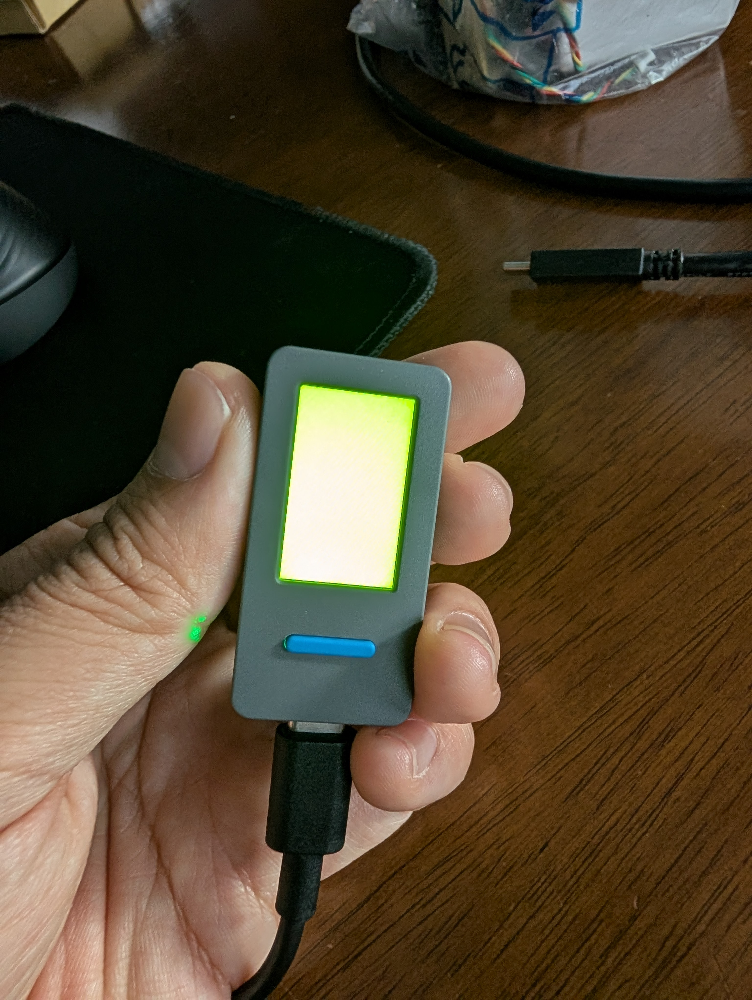
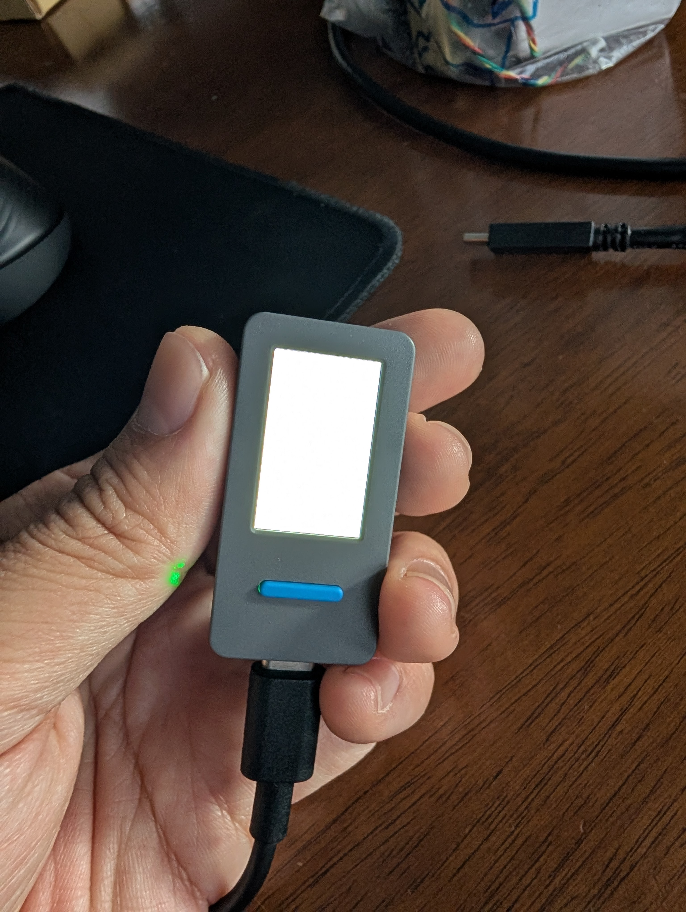

# Zephyr RTOS support for the M5Stack StickS3 (ESP32-S3) — board `m5stack_sticks3`

[](https://github.com/thc1006/zephyr-m5stack-sticks3/actions/workflows/ci.yml)
[](LICENSE)
[](https://docs.zephyrproject.org/latest/releases/release-notes-4.4.html)
[](boards/m5stack/m5stack_sticks3)

**Yes — you can run Zephyr RTOS on the M5Stack StickS3.** This repository is a
public, reproducible, upstream-oriented Zephyr 4.4 **board port** for the
**M5Stack StickS3 / M5StickS3 K150** (SoC: **ESP32-S3-PICO-1-N8R8**, 8 MB flash +
8 MB PSRAM). It has been **runtime-verified on physical hardware** for board
discovery, build, flash, boot/console, the two front buttons, the **BMI270 IMU**,
and the **ST7789(P3) LCD**.

> Board name: `m5stack_sticks3` · SoC: `esp32s3/procpu` · Zephyr: 4.4.0 ·
> Status: runtime-verified (boot, console, buttons, IMU, LCD)

<p align="center">
  
  &nbsp;&nbsp;
  
</p>
<p align="center"><sub>The M5Stack StickS3 running this Zephyr port — the ST7789P3 LCD during the
color-fill test (green and white frames), powered over USB-C. Full logs and more
photos in <a href="evidence/"><code>evidence/</code></a>.</sub></p>

Aliases people search for: *M5StickS3*, *M5Stick S3*, *StickS3 K150*,
*M5Stack StickS3 Zephyr*, *Zephyr ESP32-S3 board port*, *M5PM1 PMIC Zephyr
regulator*, *ST7789P3 Zephyr display*.

## Quick answer (TL;DR)

| Question | Answer |
| --- | --- |
| Does Zephyr support the M5Stack StickS3? | Yes, via this out-of-tree board port (`m5stack_sticks3`). |
| What's verified on hardware? | Boot/console, buttons (G11/G12), BMI270 IMU, ST7789P3 LCD. |
| What's roadmap (not yet claimed)? | Full M5PM1 PMIC (charger/audio rails), IR TX/RX, ES8311 audio, power measurement. |
| Do I need any AI tooling? | **No.** Standard `west` + Zephyr SDK + `esptool` only. |
| How is the LCD powered? | The L3B rail is gated by the M5PM1 PMIC (PYG2); an in-repo regulator driver enables it. |

## Hardware

| Component | Part | Bus / pins | Status |
| --- | --- | --- | --- |
| SoC | ESP32-S3-PICO-1-N8R8 (8 MB flash, 8 MB PSRAM) | USB-Serial/JTAG | runtime-verified |
| Buttons | KEY1 (middle), KEY2 (right) | GPIO G11 / G12 (active-low) | runtime-verified |
| IMU | Bosch BMI270 | I²C `0x68` (G48/G47) | runtime-verified |
| Display | ST7789P3 135×240 | SPI2 (mipi-dbi-spi), CS G41, offsets x=52/y=40 | runtime-verified |
| LCD/audio/IR power | M5PM1 PMIC | I²C `0x6e`, rail via PYG2 (L3B) | runtime-verified (LCD rail) |
| Audio codec | ES8311 | I²C `0x18` + I²S | roadmap |
| IR TX/RX | — | G46 / G42 (RMT) | roadmap |

## Quick start

```bash
# 1. Repo integrity check (always runnable, no Zephyr needed).
bash verify.sh

# 2. One-time: create a Zephyr 4.4 workspace + SDK (review the script first).
bash scripts/bootstrap_zephyr_ubuntu.sh

# 3. Build the validation app for the board.
bash scripts/build_m5sticks3.sh
# or directly:
west build -p always -b m5stack_sticks3/esp32s3/procpu app

# 4. Flash and watch the console (device on USB-C).
west flash
west espressif monitor
```

On Windows, flash/monitor from the host — the ESP32-S3 USB-Serial/JTAG needs
`esptool --after watchdog-reset`. See `docs/10_HARDWARE_FLASHING_NOTES.md` and
`scripts/flash_windows.ps1` / `scripts/monitor_windows.ps1`.

## What "first public port" means (scoped honestly)

A large-scale prior-art search on 2026-05-30 (three independent passes; see
`docs/00_RESEARCH_SNAPSHOT_UPDATED.md`) found **no public Zephyr board port for the
M5Stack StickS3** in the upstream tree, in open PRs/issues, or elsewhere on
GitHub/web. The defensible claim is therefore:

> First public, reproducible, upstream-oriented Zephyr RTOS board port and
> validation suite for the M5Stack StickS3 / M5StickS3 K150 (ESP32-S3-PICO-1-N8R8).

It is **not** "first Zephyr on ESP32-S3" (the SoC and sibling
StampS3/AtomS3/CoreS3 boards are long supported); **not** "first RTOS on StickS3"
(Arduino / ESP-IDF / UiFlow2 / MicroPython / ESPHome predate it); and **not**
"first M5PM1 Zephyr driver" (Zephyr PR #109961 is upstreaming an M5PM1 MFD driver
for a different board — this project reuses that work upstream, see
`docs/07_UPSTREAM_PLAN.md`).

## Evidence & honesty rule

Do not publish "working" claims beyond what `evidence/` supports. As of
2026-05-30 the LCD has photo evidence (`evidence/PXL_20260529_2351*.jpg`: panel
lit and cycling colours) plus build/flash/serial logs. Audio, IR, and full
power-management remain roadmap and must not be claimed until they have their own
captured evidence. Verification levels (scaffolded → build-verified →
flash-verified → runtime-verified → upstream-reviewed) are defined in
`docs/05_VALIDATION_MATRIX.md`.

## Repository map

```text
.
├── CONTRIBUTING.md                   # Project conventions, rules, Definition of Done
├── docs/                             # SDD, TDD, ADRs, prior art, validation, upstream plan
├── boards/m5stack/m5stack_sticks3/   # Zephyr HWMv2 board definition (procpu/appcpu)
├── drivers/regulator/                # M5PM1 L3B-rail regulator (+ native_sim emulator)
├── dts/bindings/                     # Devicetree bindings for the above
├── app/                              # Minimal hardware-validation app
├── tests/                            # Host-side integrity + native_sim ztest
├── scripts/                          # Bootstrap / build / flash helpers
├── tools/                            # Repo quality checks
└── evidence/                         # Build/flash/serial logs + LCD photos
```

## Documentation

- `CONTRIBUTING.md` — conventions, verification levels, Definition of Done.
- `docs/02_SDD.md`, `docs/03_TDD.md` — software/test design.
- `docs/05_VALIDATION_MATRIX.md` — what is verified and how.
- `docs/07_UPSTREAM_PLAN.md` — plan for contributing to Zephyr.
- `docs/10_HARDWARE_FLASHING_NOTES.md` — verified flash/monitor procedure.

## License

Apache-2.0 (matching Zephyr). See `LICENSE`.
